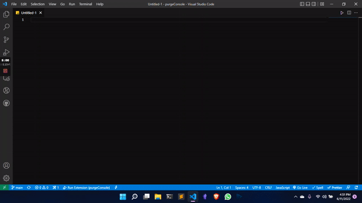

# purgeConsole

do you also get bored sometimes, in commenting or removing ``` "console.log()"``` after debugging like me ? 

then you will love this extension 💝

## Installation  

Run ``` ext install purgeConsole``` purgeConsole in the command palette.

## Usage 

Open command palette with ``` command/ctrl + p```

type ``` >``` select Emoji: Insert emoji

Run ``` Comment All console ``` or ``` Remove All console```in the command palette by hitting enter and see the magic 🪄.




---
## Made by [Karan](https://twitter.com/KaranJanthe) with ❤️

